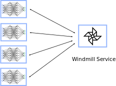
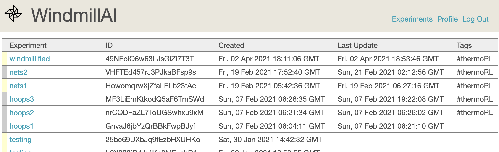
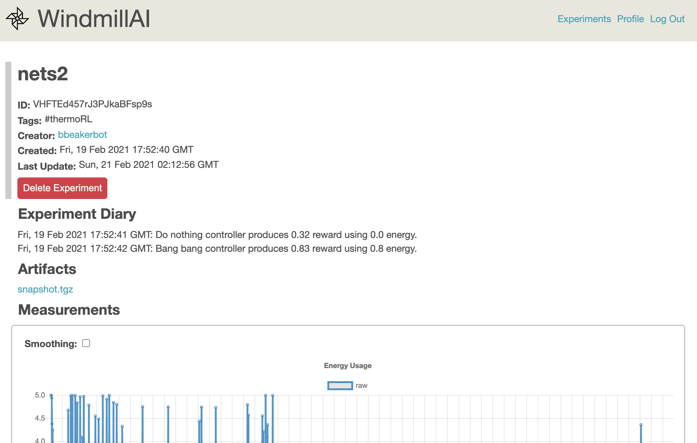
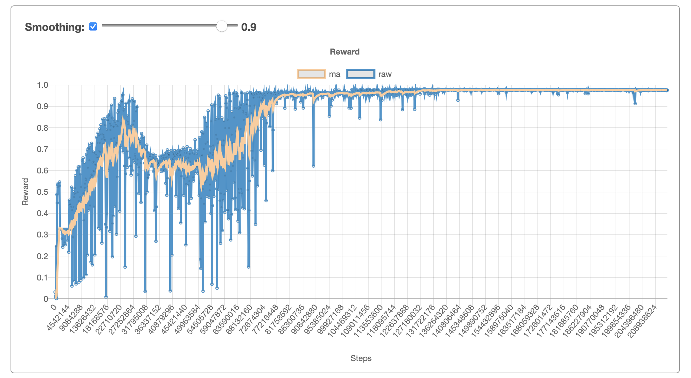

# An Overview of Windmill

Windmill helps you and your team work together on machine learning research and development. It is not another MLOps platform to help you manage stable production AI pipelines, but instead a more organized and efficient way to improve models and develop new ones.

This document gives a high level overview of Windmill. You may also be interested in getting [walk through of Windmill tools](walk.md), or a [quickstart codelab](codelabs/quickstart).

At its core, Windmill is a remote service that keeps track of your machine learning jobs. You embed a small client in your new or existing ML code that adds utilities for communicating back to the Windmill service. Since the Windmill service is stateful, you don't need to write code to deal with storing learning curves, surviving job restarts, or archiving useful data from the experiment (like your learned model).

Metrics, training artifacts, and status are collected automatically which frees you and your team to run many training jobs in parallel, either on the cloud or your own hardware, without needing to perform any manual bookkeeping. Whether working on multiple projects, trying different techniques, or parameter sweeping the training of a single model Windmill keeps track of how all your experiments are doing.

All your current and historical status is collected into a single experiments dashboard. The dashboard lists your experiments and the current status, letting you drill down into each one. Being able to see your history of experiments are archived data is exceptionally useful in the R&D process, and Windmill constructs a data browser for you automatically. Creating a single repository for ML training history frees the individual engineer from manual bookkeeping work and organizations of engineers from losing data derived from precious training and engineer time.

Experiment dashboards are similar to what might expect from various metrics dashboards, but are all always available online without any additional commands or running custom servers. This becomes particularly useful when in a collaborative setting as team members can share experiment links, create leaderboards, and see the archive of team experiments.

In enterprise mode Windmill can be used to manage a pool of compute resources for your team, ensuring fairness and managing a queue of jobs to ensure your dedicated accelerators and compute doesn't sit idle. It can also be used for monitoring resource usage and spend, and forecasting usage trends.

To continue learning take a [walk through of Windmill tools](walk.md), or jump directly to the [quickstart codelab](codelabs/quickstart).
