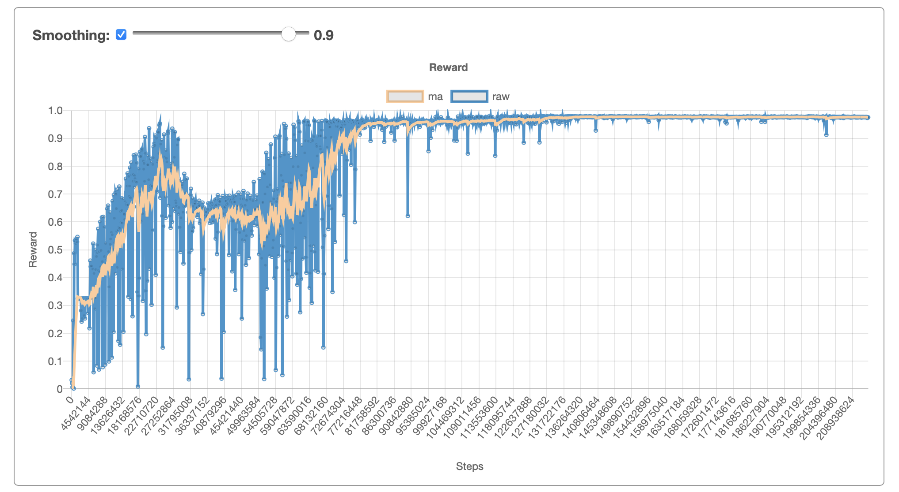

# A Walk Through of Windmill Tools

This page lists a number of commons uses and design patterns for Windmill. If you are not sure what Windmill is check out the [overview](overview.md) and if you're ready to start coding check out the [quickstart codelab](codelabs/quickstart).

## Experiments and Work Units

An experiment is a logical grouping of work units, and a work unit is typically a single binary running a training pipeline. Experiments are created through the client, e.g.,

```
wu: WorkUnit = client.create_experiment(experiment_name='my_experiment',
                                        tags=['codelabs', 'testing'])
```

Tags can be used to organize similar experiments, for example every training run for your new system may have a different moniker but use the same tag to group all experiments together for your team to review.

The returned `wu` object represents a work unit which is uniquely identified by an experiment id (`xid`) and a worker id (`wid`). It has member functions that allow you to transfer to state to WindmillAI or retrieve it. (See the sections below!)

If your training job is meant to persist through restarts you will likely create your experiment in a launch script and pass `xid`/`wid` to the training binary. You can then reconstruct the work unit object every time the job starts.

```
wu: WorkUnit = client.get_work_unit(FLAGS.xid, FLAGS.wid)
```

Experiments can also be constructed with many work units, for example to conduct a parameter sweep.

```
wus: List[WorkUnit] = client.create_experiment(
    experiment_name='my_parameter_sweep',
    tags=['codelabs', 'testing'],
    params=[{'hidden_layers': 2}, {'hidden_layers': 3}, {'hidden_layers': 4}])
```

This will create 3 work units, and the work unit that identifies with the appropriate `wid` will be able to access the apropos parameter dictionary.

The Windmill service will track the status of your work units (e.g., whether they've transmitted data recently) on a [centralized dashboard](http://www.WindmillAI.com/user). When the job is complete the work unit and experiment can be marked completed.

```
wu.complete_experiment()
```

## Metrics

Metrics can be sent from each of your work units so you can view their progress through the web ui and archive learning curves automatically.

For example, to record the reward from a reinforcement learning pipeline after a particular number of training steps were observed.

```
wu.record_measurements({
    'label': 'reward',
    'value': reward_value,
    'steps': steps,
    })
```



Measurements can be batched either for the same metric...

```
wu.record_measurements({
    'label': 'reward',
    'value': reward_value1,
    'steps': steps1,
    }, {
    'label': 'reward',
    'value': reward_value2,
    'steps': steps2,
    })
```

... or different metrics.

```
wu.record_measurements({
    'label': 'reward',
    'value': reward_value,
    'steps': steps,
    }, {
    'label': 'training_loss',
    'value': loss,
    'steps': steps,
    })
```

## Diary

An experiment diary is essentially a collection of strings that are displayed on the web ui and archived. They can be used to create notifications or just record one-off information that isn't quite time series data.

```
wu.add_diary_entry('Initial simulation time took {}s.'.format(start_time))
```

```
wu.add_diary_entry('Reaching benchmark performance took {} steps.'.format(steps))
```

## Artifacts

Windmill allows you to upload artifacts, a.k.a. data, associated to your experiments. For example, if you are training a generative model that creates images you may want to periodically generate outputs throughout training so you can review progress in the Windmill web ui.

```
for i in range(num_epochs):
  train(model, data_source)
  z = generate(model)
  im = Image.fromarray(z)
  fn = 'generated_at_epoch_{}.png'.format(i)
  path = '/tmp/{}'.format(fn)
  im.save(path)
  wu.create_artifact_from_file(fn, path)
```

You can also save whole directories as compressed archives, and choose whether you will overwrite a single filename (e.g., the latest version) or change the filename as you train (e.g., the time series history of artifacts).

## Training State

Most ML frameworks like Tensorflow, PyTorch, or Jax have a mechanism for checkpointing state to disk. However, if you're working on machines where the disk usage is ephemeral (like on Cloud), you want to be able to transfer that state between machines, or you just want to archive state with an experiment you are left with the software engineering task of managing those files. With Windmill you can create a "hello world"-effort training script that has first-class checkpointng.

```
_SNAPSHOT_FN = 'snapshot.tgz'
_SNAPSHOT_PATH = '/tmp/snapshot'

# Restore previous training state (if necessary).
if wu.artifact_exists(_SNAPSHOT_FN):
  wu.get_directory_artifact(_SNAPSHOT_FN, _SNAPSHOT_PATH)

while True:
  train(model)
  snapshot(model, _SNAPSHOT_PATH)
  su.create_artifact_from_directory(_SNAPSHOT_FN, _SNAPSHOT_PATH)
```

Now your training process can seamlessly transfer between machines, and you can always pick things back up later because you've archived state on Windmill.

## Signals (Remote Control)

Windmill signals are like remote controls for your training job. The simplest example creating a signal to stop your job, which is particularly useful if you're training remote and CTRL+C requires a lot of work.

```
_SIGNAL = 'stop_training'
wu.register_signal(_SIGNAL)

while not wu.check_signal_active(_SIGNAL):
  train()

wu.complete_experiment()
```

Now you can use the web ui to control your jobs wherever they are with only a few extra lines of code.

## Next Steps

Use the [quickstart codelab](codelabs/quickstart) to get started with Windmill.
